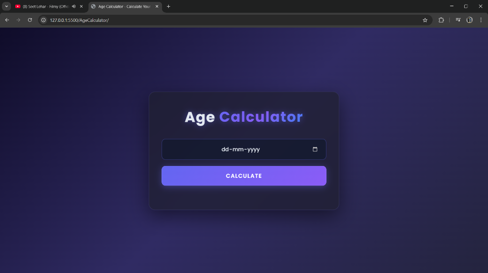
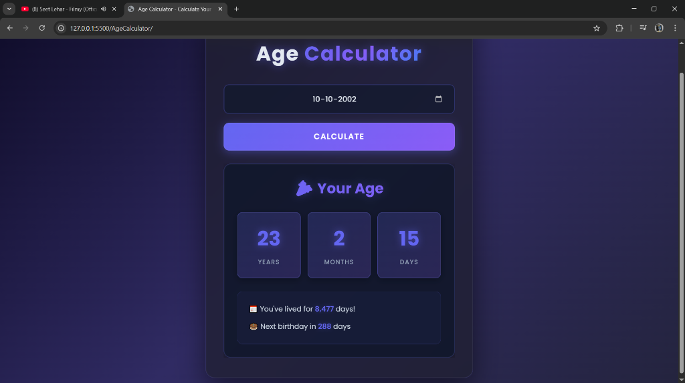

# 🎂 Age Calculator

A modern, professional age calculator web application with a stunning dark theme and smooth animations. Calculate your exact age in years, months, and days, along with additional insights like total days lived and days until your next birthday.


## ✨ Features

- **🎯 Accurate Age Calculation**: Calculates your exact age in years, months, and days
- **📊 Additional Insights**:
  - Total days you've lived
  - Days remaining until your next birthday
- **🌙 Dark Professional Theme**: Modern, sleek design with a dark gradient background
- **✨ Smooth Animations**: Fade-in effects and hover interactions for enhanced UX
- **📱 Responsive Design**: Works seamlessly on desktop, tablet, and mobile devices
- **🎨 Premium Aesthetics**:
  - Glassmorphism effects with backdrop blur
  - Vibrant purple/blue accent colors
  - Custom Google Fonts (Poppins)
  - Glowing shadows and shimmer effects
- **⚡ Real-time Validation**: Instant error handling with user-friendly messages
- **🚀 Fast & Lightweight**: Pure vanilla JavaScript, no dependencies

## 🖼️ Screenshots

### Main Interface
The clean, modern interface with a professional dark theme.



### Age Results
Detailed breakdown showing years, months, days, total days lived, and days until next birthday.



## 🚀 Getting Started

### Prerequisites

- A modern web browser (Chrome, Firefox, Safari, Edge)
- No additional dependencies or installations required!

### Installation

1. **Clone the repository** or download the files:
   ```bash
   git clone https://github.com/RamranVijay10/Mini-JavaScript-Projects.git
   ```

2. **Navigate to the project directory**:
   ```bash
   cd AgeCalculator
   ```

3. **Open the application**:
   - Simply open `index.html` in your web browser
   - Or use a local server (optional):
     ```bash
     # Using Python
     python -m http.server 8000
     
     # Using Node.js (http-server)
     npx http-server
     ```

4. **Start calculating ages!** 🎉

## 📖 Usage

1. **Enter Your Birthdate**: Click on the date input field and select your birthdate
2. **Click Calculate**: Press the "CALCULATE" button
3. **View Results**: Your age will be displayed with:
   - Years, Months, and Days
   - Total days you've lived
   - Days until your next birthday

### Example
- **Input**: October 10, 2002
- **Output**: 
  - 23 Years, 2 Months, 15 Days
  - 8,477 total days lived
  - 288 days until next birthday

## 🛠️ Technical Details

### Project Structure
```
AgeCalculator/
│
├── index.html          # Main HTML structure
├── style.css           # Styling and animations
├── script.js           # Age calculation logic
└── README.md           # Project documentation
```

### Technologies Used

- **HTML5**: Semantic markup structure
- **CSS3**: 
  - Custom properties (CSS variables)
  - Flexbox for layout
  - Animations and transitions
  - Backdrop filters for glassmorphism
  - Media queries for responsiveness
- **JavaScript (ES6+)**:
  - Date manipulation
  - DOM manipulation
  - Event handling
  - Input validation

### Key Functions

#### `calculateAge(birthDate)`
Calculates the exact age based on the provided birthdate.

**Returns:**
```javascript
{
  years: number,
  months: number,
  days: number,
  totalDays: number,
  daysUntilBirthday: number
}
```

#### `displayResult(age)`
Displays the calculated age with smooth animations.

#### `displayError(message)`
Shows user-friendly error messages for validation failures.

## 🎨 Design Features

### Color Palette
- **Background Gradient**: Deep navy to purple (`#0f0c29` → `#302b63` → `#24243e`)
- **Primary Accent**: Indigo (`#6366f1`)
- **Secondary Accent**: Purple (`#8b5cf6`)
- **Text Colors**: Light slate and white for optimal contrast

### Typography
- **Font Family**: Poppins (Google Fonts)
- **Weights**: 300 (Light), 400 (Regular), 500 (Medium), 600 (Semi-bold), 700 (Bold)

### Animations
- Fade-in effects for results
- Shimmer animation on the title
- Hover effects on buttons and inputs
- Smooth transitions throughout

## 📱 Responsive Design

The application is fully responsive and adapts to different screen sizes:

- **Desktop**: Full-width container (max 600px)
- **Tablet**: Optimized padding and spacing
- **Mobile**: Adjusted font sizes and compact layout

## 🔧 Customization

### Changing Colors
Edit the CSS variables or color values in `style.css`:
```css
/* Example: Change accent color */
background: linear-gradient(135deg, #your-color-1, #your-color-2);
```

### Modifying Calculations
Update the logic in `script.js` to add new features or change calculation methods.

### Adding Features
Some ideas for enhancement:
- Add age in weeks, hours, minutes
- Include zodiac sign calculation
- Add birthday countdown timer
- Export results as PDF or image
- Multi-language support

## 🐛 Known Issues

None at the moment! If you find any bugs, please report them.

## 🤝 Contributing

Contributions are welcome! Feel free to:
1. Fork the repository
2. Create a feature branch (`git checkout -b feature/AmazingFeature`)
3. Commit your changes (`git commit -m 'Add some AmazingFeature'`)
4. Push to the branch (`git push origin feature/AmazingFeature`)
5. Open a Pull Request

## 📝 License

This project is open source and available under the [MIT License](LICENSE).

## 👨‍💻 Author

**Ramran Vijay**
- GitHub: [@RamranVijay10](https://github.com/RamranVijay10)
- LinkedIn: [Ramran Vijay Pratap Yadav](https://www.linkedin.com/in/ramran-vijay-pratap-yadav-252400295)
- Email: stkhunter01@gmail.com
- Portfolio: [Mini JavaScript Projects](https://github.com/RamranVijay10/Mini-JavaScript-Projects)

## 🙏 Acknowledgments

- Google Fonts for the beautiful Poppins typeface
- Inspiration from modern web design trends
- The web development community for best practices

## 📞 Support

If you have any questions or need help, feel free to:
- Open an issue on GitHub
- Contact me via email
- Submit a pull request

---

<div align="center">
  Made with ❤️ and JavaScript
  <br>
  <sub>© 2025 Age Calculator. All rights reserved.</sub>
</div>
